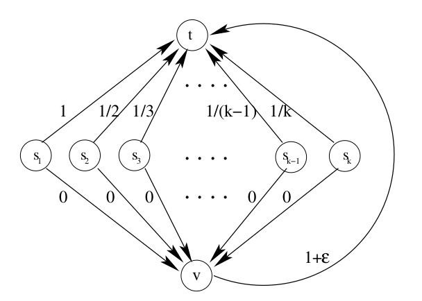

# Exercise Set VIII

### Exercise 65

Let $\mathbf{P}$ and $\mathbf{P}^\*$ be the equilibrium and the optimum solutions, in which every $i$ chooses paths $P_i$ and $P_i^\*$ respectively.
Since $\mathbf{P}$ is an equilibrium, any unilateral deviation can only increase the individual cost, so

$$
\forall i,\ C_i(\mathbf{P}) \le C_i(P_i^\*, \mathbf{P}_{-i}). \ \ \ \ (*).
$$

Let's investigate the RHS of this inequality.
Let $f_e^i$ and $f_e^\*$ be the number of times an edge $e$ is traversed in action profiles $(P_i^\*, \mathbf{P}_{-i})$ and $\mathbf{P}^\*$ respectively.
Then,

$$
C_i(P_i^*, \mathbf{P}_{-i}) 
    = \sum_{e \in P_i^\*} \frac{\gamma_e}{f_e^i} 
    \le \sum_{e \in P_i^\*} \gamma_e
    \le \sum_{e\ :\ f_e^\* \ge 1} \gamma_e
    = \mathrm{cost}(\mathbf{P}^\*).
$$

Summing (*) over $i$, we get

$$
\mathrm{cost}(\mathbf{P})
    = \sum_{i=1}^k C_i(\mathbf{P})
    \le \sum_{i=1}^k C_i(P_i^\*, \mathbf{P}_{-i})
    \le k \cdot \mathrm{cost}(\mathbf{P}^\*).
$$

So, the POA in network cost-sharing games is upper-bounded by the number of players $k$.

### Exercise 66

Consider the familiar game but imagine all the edges are undirected:

Many interesting equilibriums arise. We are interested in two of them:
1. All players get to $s_k$ through $v$ and then go to $t$. The total cost of the solution is only $1/k$. It is an optimal outcome as well.
2. All players get to $s_1$ through $v$ and then go to $t$. The total cost of the solution is $1$. The individual cost is $1/k$ for all players, so no beneficial unilateral deviations exist. It is the worst equilibrium.

The price of anarchy in this example is $k$, which is a lot, but since one equilibrium is optimal, the price of stability is just $1$.

### Exercise 67

Let $\mathcal P$ denote the set of all $s-t$ paths in the network. Let

$$
P^* \in \underset{P \in \mathcal P}{\mathrm{Argmin}} \sum_{e \in P} \gamma_e,
$$

i.e. pick an arbitrary geodesic $s-t$ path. Let's denote its length as $\Gamma$.

Let's show that the action profile $\mathbf{P}^\* = (\underbrace{P^\*, \dots, P^\*}_{k})$ is both optimal and strong equilibrium solution.

First observe that

$$
C_i(\mathbf{P}^\*) = \sum_{e \in P^\*} \frac{\gamma_e}{k} = \frac{\Gamma}{k},\
\mathrm{cost}(\mathbf{P}^*) = \Gamma.
$$

Let $\mathbf{P}$ be an arbitrary action profile, then

$$
C_i(\mathbf{P})
    = \sum_{e \in P_i} \underbrace{\frac{1}{f_e}}\_{\ge 1/k} \gamma_e
    \ge \frac{1}{k} \underbrace{\sum_{e \in P_i} \gamma_e}\_{\ge \Gamma}
    \ge C_i(\mathbf{P}^*).
$$

This inequality gives us two important results:
1. No agent can be made better off by any coalitional deviation from $\mathbf{P}^\*$ to $\mathbf{P},$ so $\mathbf{P}^\*$ is strong equilibrium.
2. Summing over $i$ gives $\mathrm{cost}(\mathbf{P}) \ge \mathrm{cost}(\mathbf{P}^\*)$, so $\mathbf{P}^\*$ is the optimal solution.

So, in network cost-sharing games with source and target nodes being the same for all agents, the POA is $1$, and an optimal SNE solution is all agents simultaneously using a geodesic path from source to target.
No other action profile (except simultaneously using other geodesic paths) can be SNE because individual cost can only be made higher by any coalitional deviation.

### Exercise 68

First player has two pure strategies, $P_1 = (s_1, v, t_1)$ and $P_2 = (s_1, s_2, v, t_1)$. Second one also has two, $P_3 = (s_2, v, v_2)$ and $P_4 = (s_2, v, t_1, t_2)$. Let's construct the game matrix:

| Player 1 / 2 |    $P_3$     |    $P_4$     |
| :----------: | :----------: | :----------: |
|    $P_1$     |   $(5; 5)$   | $(3.5; 5.5)$ |
|    $P_2$     | $(5.5; 3.5)$ |   $(4; 4)$   |

The Pure NE profile is $(P_1, P_3)$. Since Strong NE are also Pure NE, other three action profiles can't be Strong NE.
However, the pure strategy equilibrium profile we've found is also not Strong NE because bilateral deviation to $(P_2, P_4)$ makes both players better off.

### Exercise 69 (noice)

Consider the following two-player payoff maximization game:

| Player 1/2 |   $D$    |   $E$    |   $F$    |
| :--------: | :------: | :------: | :------: |
|    $A$     | $(3; 3)$ | $(0; 0)$ | $(0; 0)$ |
|    $B$     | $(0; 0)$ | $(2; 1)$ | $(1; 2)$ |
|    $C$     | $(0; 0)$ | $(1; 2)$ | $(2; 1)$ |

The only PNE of this game is $(A; D)$.
However when initialized with any of the outcomes $(B; E)$, $(B; F)$, $(D; E)$, $(D; F)$, best-response dynamics algorithm infinitely cycles over those four, never reaching the equilibrium.

### Exercise 70

Unlike with potential functions, where the existence of PNE follows immediately from the fact that the potential has a global minimum, here equilibria need not correspond to local minima of $\Phi$ (we don't require $C_i(s_i^\prime, s_{-i}) \ge C_i(s) \Rightarrow \Phi(s_i^\prime, s_{-i}) \ge \Phi(s)$ ).

Nevertheless, we still can guarantee the existence of PNE using best-response dynamics.
Since on every iteration the cost of some player strictly decreases, $\Phi(s^t)$ also strictly decreases.
But this means that we can't find such $t_1$ and $t_2$ that $s^{t_1} = s^{t_2}$, i.e. the algorithm never cycles.
Since the game is finite, it is clear that the algorithm must stop at some point, which would be a PNE of the game.

### Exercise 71

To show that $\varepsilon$-BRD converges fast when we use MaxRelativeGain instead of MaxGain, we use exactly the same reasoning, and we only need to ensure that Lemma 2 still holds.

**Lemma**. 
Suppose player $i$ is chosen in the outcome $s$ by MaxRelativeGain $\varepsilon$-BRD, and takes the $\varepsilon$-move $s_i^\prime$. Then,

$$
\forall j,\ C_i(s) - C_i(s_i^\prime, s_{-i}) \ge \frac{\varepsilon}{\alpha} C_j(s).
$$

*Proof*. Fix arbitrary $j$.

If $j$ has an $\varepsilon$-move $s_j^\prime$ (WLOG, let it be the best one of them, if there are many), then $i$'s relative gain is greater than $j$'s, i.e.

$$
\frac{C_i(s) - C_i(s_i^\prime, s_{-i})}{C_i(s)} \ge \frac{C_j(s) - C_j(s_j^\prime, s_{-j})}{C_j(s)},
$$

and, after some simple manipulations,

$$
C_i(s) \ge C_j(s) \frac{C_i(s_i^\prime, s_{-i})}{C_j(s_j^\prime, s_{-j})}. \ \ \ \ (*)
$$

Now let's consider the fraction $C_i(s_i^\prime, s_{-i}) / C_j(s_j^\prime, s_{-j})$.
Since we fixed $s_j^\prime$ to be the best $\varepsilon$-move of $j$, and all the players have the same paths to choose from, we know that $C_j(s_j^\prime, s_{-j}) \le C_j(s_i^\prime, s_{-j})$.
In the original proof of the lemma it was shown that when the cost functions are $\alpha$-bounded, $C_j(s_i^\prime, s_{-j}) \le \alpha C_i(s_i^\prime, s_{-i})$.
Substituting it into (*), we get

$$
C_i(s) \ge \frac{1}{\alpha} C_j(s).
$$

Since $s_i^\prime$ is an $\varepsilon$-move of $i$,

$$
C_i(s) - C_i(s_i^\prime, s_{-i}) \ge \varepsilon C_i(s) \ge \frac{\varepsilon}{\alpha} C_j(s).
$$

If $j$ doesn't have an $\varepsilon$-move, the reasoning is the same as before because it doesn't depend on player selection procedure. 

So, the lemma holds as well as the theorem on $\varepsilon$-BRD convergence complexity bounds.
